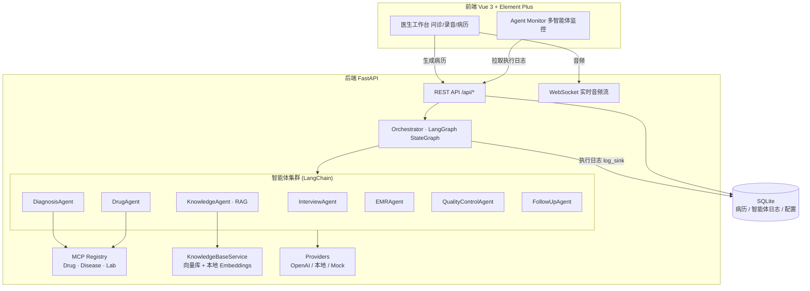
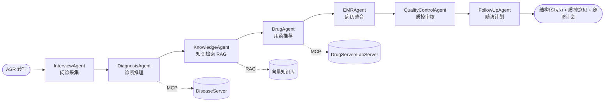
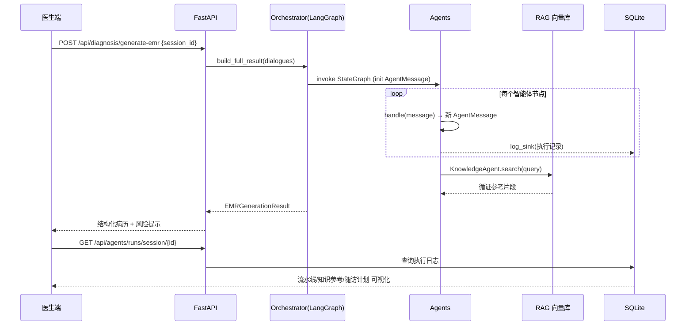
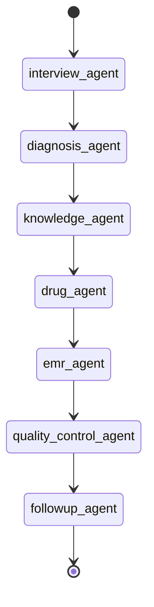

# 系统架构图

## 1. 整体架构

## 2. 智能体协作流程（A2A 消息链）

每条箭头都是一次 `AgentMessage`（A2A）传递：上游智能体的输出经 `message.reply()` 合并进 `payload` 后递交给下游，`task_id` 贯穿全链路。

## 3. 数据流（一次问诊）

## 4. LangGraph 状态机

唯一状态通道为 `_WorkflowState.message`（`AgentMessage`）。当前为线性管线，架构上可平滑扩展为：质控不通过时回环至问诊补充（条件边）、知识检索与用药推荐并行（并行节点）等。
